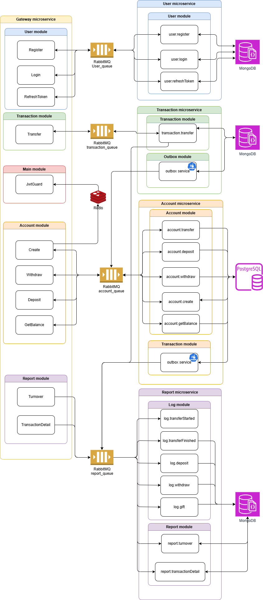
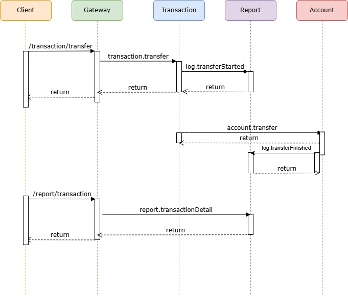

# banking-system-microservice

## Overview
This project is a robust financial application built using a microservices architecture with NestJS. It comprises five distinct microservices—Gateway, User, Account, Transaction, and Report—each responsible for specific functionalities within the system. The application leverages RabbitMQ for inter-service communication, PostgreSQL and MongoDB for data persistence, and Redis for caching, ensuring scalability, reliability, and maintainability.

## Architecture



The application is divided into the following microservices:

1. **Gateway**: Acts as the entry point, handling HTTP requests, authorization, and routing them to appropriate microservices via RabbitMQ.
2. **User**: Manages user authentication, including login and logout functionalities.
3. **Account**: Handles account operations such as creation, transfers, deposits, withdrawals, and balance inquiries.
4. **Transaction**: Processes transfer requests, interacting with both the Account and Report services to manage transaction loads efficiently using cron jobs.
5. **Report**: Provides detailed transaction reports and account turnover information.


## Sequence Diagrams

### Transaction/Transfer Request Flow

The sequence diagram below illustrates the flow of a transfer request initiated at the Gateway, processed by the Transaction service, and executed by the Account service, with updates sent to the Report service.



## Getting Started

### Prerequisites

Ensure you have the following installed on your machine:

- [Docker](https://www.docker.com/get-started)
- [Docker Compose](https://docs.docker.com/compose/install/)
- [Git](https://git-scm.com/downloads)

### Installation

1. **Clone the Repository**

   ```bash
   git clone https://github.com/sajjadpoores/banking-system-microservice.git
   cd banking-system-microservice
   ```

2. **Initialize Environment Variables**

   Each microservice contains a `production.env.example` file within its `env` directory. These files provide the necessary environment variable templates.

   you can manually copy the example files:

   ```bash
   cp ./gateway-microservice/env/production.env.example ./gateway-microservice/env/production.env
   cp ./user-microservice/env/production.env.example ./user-microservice/env/production.env
   cp ./account-microservice/env/production.env.example ./account-microservice/env/production.env
   cp ./report-microservice/env/production.env.example ./report-microservice/env/production.env
   cp ./transaction-microservice/env/production.env.example ./transaction-microservice/env/production.env
   ```

#### 3. Create Databases Manually

Before running the application, you need to create the required databases manually in PostgreSQL and MongoDB.

**PostgreSQL**

1. **Access PostgreSQL Shell**

   ```bash
   docker exec -it banking-system-microservice-postgres-1 psql -U postgres
   ```

2. **Create Databases**

   Within the PostgreSQL shell, execute the following commands:

   ```sql
   CREATE DATABASE user;
   CREATE DATABASE account;
   ```

   Exit the PostgreSQL shell:

   ```sql
   \q
   ```

**MongoDB**

MongoDB typically creates databases automatically when a connection is made. However, if you prefer to create them manually:

1. **Access MongoDB Shell**

   ```bash
   docker exec -it banking-system-microservice-mongo-1 mongo
   ```

2. **Create Databases**

   Within the MongoDB shell, execute the following commands:

   ```javascript
   use report
   use transaction
   ```

   Exit the MongoDB shell:

   ```javascript
   exit
   ```
### Running the Application

**Build and Start Services**

   From the project root directory, run:

   ```bash
   docker-compose up --build
   ```

## API Documentation
you can access the Swagger UI for gateway microservice at the following endpoint:

[http://localhost:3000/api](http://localhost:3000/api)